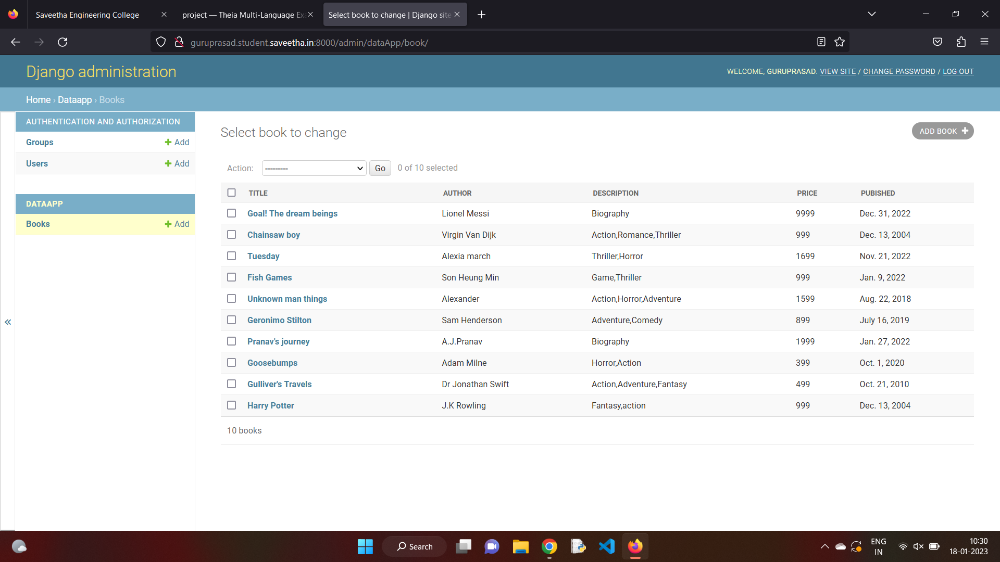

# Django ORM Web Application

## AIM
To develop a Django application to store and retrieve data from a database using Object Relational Mapping(ORM).

## DESIGN STEPS

### STEP 1:
Clone the repository to theia ide. start a new app inside the project folder


### STEP 2:
Tyoe the appropriate code for your table and provide appropriate data types to the columns.


### STEP 3:

Create a report about your project in readme.md file and upload the django.orm.pp folder to your remote repository


## PROGRAM
```python
admin.py 
from django.contrib import admin
from .models import book,adminguru
admin.site.register(book,adminguru)

models.py
from django.db import models
from django.contrib import admin

class book(models.Model):
    title=models.CharField(max_length=200)
    author=models.CharField(max_length=200)
    description=models.TextField()
    price=models.IntegerField()
    pubished=models.DateField()
class adminguru(admin.ModelAdmin):
    list_display= ('title','author','description','price','pubished')
```


## OUTPUT



## RESULT
Hence we developed a Django application to store and retrieve data from a database using Object Relational Mapping(ORM).
